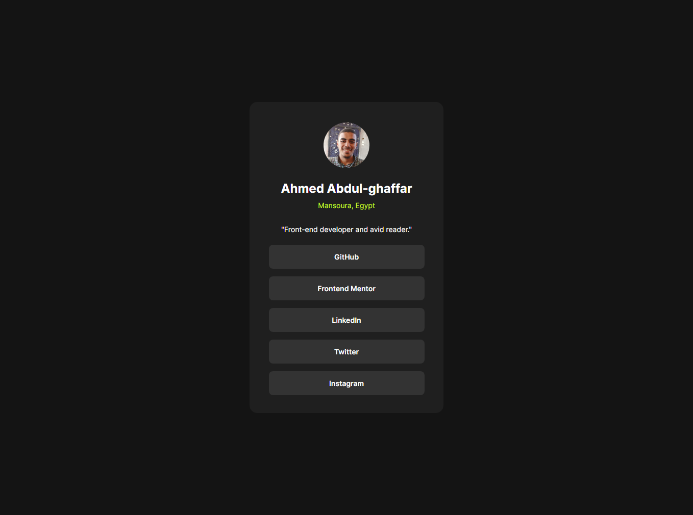

# Frontend Mentor - Social links profile solution

This is a solution to the [Social links profile challenge on Frontend Mentor](https://www.frontendmentor.io/challenges/social-links-profile-UG32l9m6dQ). Frontend Mentor challenges help you improve your coding skills by building realistic projects.

## Table of contents

- [Overview](#overview)
  - [The challenge](#the-challenge)
  - [Screenshot](#screenshot)
  - [Links](#links)
- [My process](#my-process)
  - [Built with](#built-with)
  - [What I learned](#what-i-learned)
  - [Continued development](#continued-development)
  - [Useful resources](#useful-resources)
- [Author](#author)

## Overview

### The challenge

Users should be able to:

- See hover and focus states for all interactive elements on the page

### Screenshot



### Links

- Solution URL: [solution URL](https://github.com/Ahmed-Abdul-ghaffar/social-links-profile)
- Live Site URL: [live site URL](https://ahmed-abdul-ghaffar.github.io/social-links-profile/)

## My process

### Built with

- **HTML5** - For the basic structure of the page.
- **CSS3** - To style the page, including custom fonts and responsive design.
- **CSS Flexbox & Grid** - For layout structuring, centering, and alignment.
- **GitHub Pages** - For deployment and hosting the project online.
- **Custom Fonts** (Inter) - Using `@font-face` to add custom fonts from local files.
- **Responsive Design** - Applied media queries to adapt the design for smaller screen sizes (mobile-friendly).
- **Custom Cursor** - Added a custom cursor image to enhance the user experience.
- **Frontend Mentor** - Design inspiration and resources.

### What I learned

Through this project I learned some useful things:

- I learned a new way to center the image and the full content of the card horizontally.

```css
.card {
  background-color: hsl(0, 0%, 12%);
  /* this is used to center the content horizontally */
  display: grid;
  place-items: center;

  border-radius: 15px;
  margin: 200px 0;
}
```

- I also enjoyed using a custom cursor image which introduced me to do some modifcations in the image before using it, one of it is how to isolate the cursor from the image.
  I used [remove.bg](https://www.remove.bg/) to do this.

```css
.card-author-connections:hover {
  background-color: hsl(75, 94%, 57%);
  color: hsl(0, 0%, 8%);

  /* using a custom cursor */
  cursor: url(assets/images/black-pointer-cursor.png), auto;
}
```

### Continued development

God willing, I plan to focus on CSS layouts, particularly CSS Grid, as I used it to horizontally center the content of the card in this project. Additionally, I aim to improve my skills in creating pixel-perfect applications that are consistent across both mobile and desktop designs, and there are courses in my roadmap covering these topics.

### Useful resources

- [pixel perfect](https://chromewebstore.google.com/detail/perfectpixel-by-welldonec/dkaagdgjmgdmbnecmcefdhjekcoceebi) - I used this extension to help make the design very close to the required task.
- [ChatGPT by OpenAI](https://openai.com/chatgpt/) - It helped me to use a custom cursor and to center the content of the card horizontally using CSS Grid.

## Author

- Frontend Mentor - [@Ahmed-Abdul-ghaffar](https://www.frontendmentor.io/profile/Ahmed-Abdul-ghaffar)

- GitHub - [ahmed-abdul-ghaffar](https://github.com/ahmed-abdul-ghaffar)

- LinkedIn - [Ahmed Abdul-ghaffar](https://www.linkedin.com/in/ahmed-abdul-ghaffar-79535b23a/)
